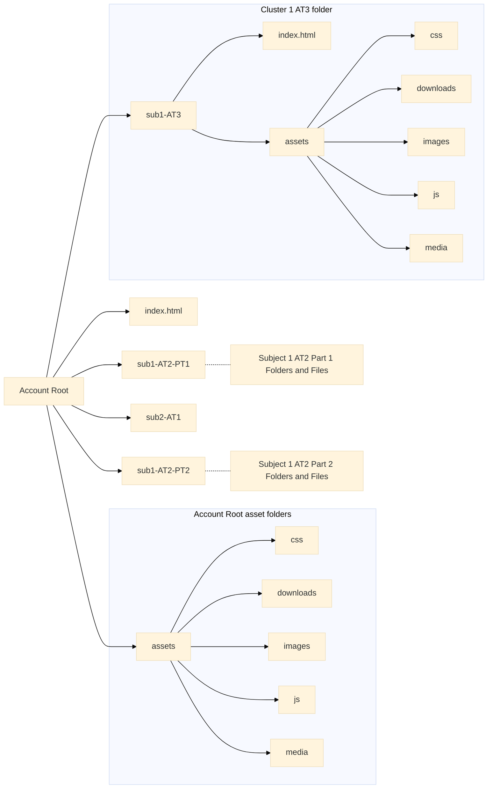

# Basic Dummy Site Page

This repository contains a basic "home page" and folder structure for 
use in Certificate III and Certificate IV studies.

Structure contains:

```mermaid
%%{
  initialize: {
    "theme" : "base"
  }
}%%

flowchart LR
    A[Account Root] --> B[assets]
    A --> AI[index.html]
    subgraph Account Root asset folders
    B --> BA[css]
    B --> BB[downloads]
    B --> BC[images]
    B --> BD[js]
    B --> BE[media]
    end
    A --> C[sub1-AT2-PT1]
    C -.- CA[Subject 1 AT2 Part 1 Folders and Files]
    A --> D[sub1-AT2-PT2]
    D -.- DA[Subject 1 AT2 Part 2 Folders and Files]
    A --> E[sub1-AT3]
    subgraph Cluster 1 AT3 folder
    E --> EI[index.html]
    E --> EZ[assets]
    EZ --> EA[css]
    EZ --> EB[downloads]
    EZ --> EC[images]
    EZ --> ED[js]
    EZ --> EE[media]
    end
    A --> F[sub2-AT1]
```